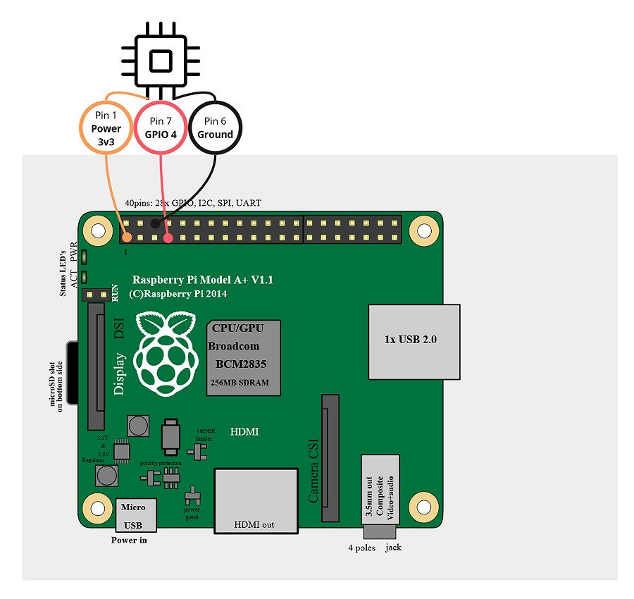

# DHT Temperature & Humidity Prometheus Exporter

This is a custom Prometheus exporter add-on for Home Assistant. It's designed for HA running on a Raspberry Pi with a DHT Temperature & Humidity Sensor.

It should work with [DHT11, DHT22 and AM2302 Sensors](https://learn.adafruit.com/dht/overview)

### Metrics

```
dht_exporter_humidity
dht_exporter_temperature
dht_exporter_error_total
```

## Installation

1. Install a compatible DHT sensor to you're Raspberry Pi running HA.

   

1. Add [repository](https://github.com/wymangr/hassos-addons) to Home Assistant.
1. Search for "DHT Exporter" in the Home Assistant add-on store and install it.
1. Update configuration on the add-on "Configuration" Tab. See options below.
1. Update port in under "Network" on the "Configuration" tab if needed accessible externally.
1. Start the add-on.
1. Check the `Logs` to confirm the add-on started successfully.
1. You can also browse the metrics by visiting `http://<homeassistnat_ip>:8182/metrics` in your browser.

## Configuration

### Exporter Config

| Config       | Description                                             | Default value | Required |
| ------------ | ------------------------------------------------------- | ------------- | -------- |
| `pin`        | GPIO pin the DHT sensor is connected to.                | 4             | Yes      |
| `sensor`     | The sensor being used. (2302,22,11)                     | 2302          | Yes      |
| `location`   | Location tag for the prometheus metric.                 |               | Yes      |
| `fahrenheit` | Display temperature in Fahrenheit. Defaults to Celsius. | false         | No       |
| `pi_chip`    | Hardware ID for Raspberry Pi Processor.                 | BCM2711       | Yes      |

**Note**: `pi_chip` is a [workaround](https://github.com/raspberrypi/linux/issues/2110) for missing `Hardware` field in arm64 version of Raspberry Pi Linux. List of processors can be found [here](https://www.raspberrypi.com/documentation/computers/processors.html).

### Prometheus Config Example

```
scrape_configs:
- job_name: 'dht_exporter'
  static_configs:
  - targets: ['<homeassistnat_ip>:8182']
```

### Grafana Alloy Config Example

```
prometheus.scrape "dht_exporter" {
	targets = [{
		__address__ = "<homeassistnat_ip>:8182",
	}]
	forward_to = [prometheus.remote_write.default.receiver]
	job_name   = "dht_exporter"
}
```

## Support

- Tested on a `Raspberry Pi 4 Model B` with a `AM2302`

## Todo

- [ ] Add Github workflows
- [ ] Build and publish a docker image so users don't have to build the image on every install
- [ ] Add Tests
- [ ] Rewrite in Go (prometheus-client doesn't work well with multiprocessing and Python)
