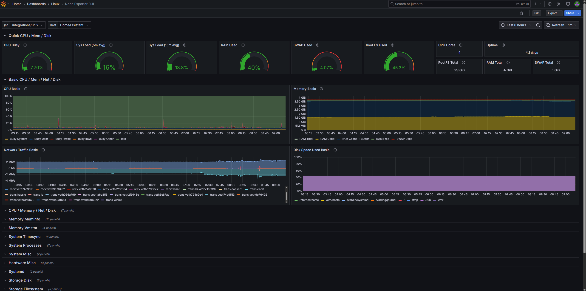
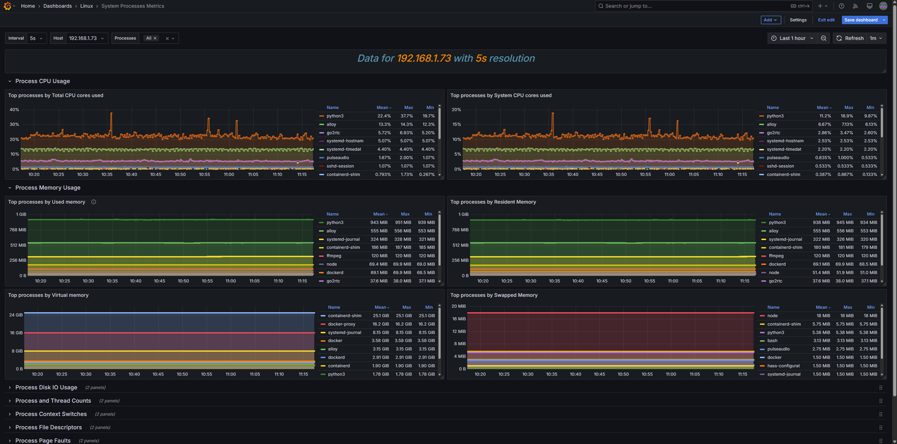
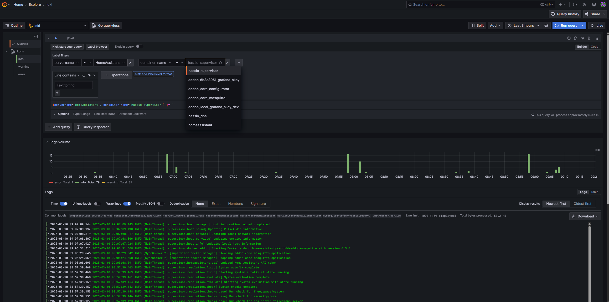

# Grafana Alloy

[Grafana Alloy](https://grafana.com/docs/alloy) combines the strengths of the leading collectors into one place. Whether observing applications, infrastructure, or both, Grafana Alloy can collect, process, and export telemetry signals to scale and future-proof your observability approach.

Currently, this add-on supports the following components:

- [prometheus.scrape](https://grafana.com/docs/alloy/latest/reference/components/prometheus/prometheus.scrape/) - Sends metrics to Prometheus write endpoint.
- [prometheus.exporter.unix](https://grafana.com/docs/alloy/latest/reference/components/prometheus/prometheus.exporter.unix/) - Uses the [node_exporter](https://github.com/prometheus/node_exporter) to expose Home Assistant Hardware and OS metrics for \*nix-based systems.
- [prometheus.exporter.process](https://grafana.com/docs/alloy/latest/reference/components/prometheus/prometheus.exporter.process/) - Enables [process_exporter](https://github.com/ncabatoff/process-exporter) to collect Home Assistant process stats from /proc.
- [loki.write](https://grafana.com/docs/alloy/latest/reference/components/loki/loki.write/) - Sends logs to Loki instance.
- [loki.source.journal](https://grafana.com/docs/alloy/latest/reference/components/loki/loki.source.journal/) - Collects Home Assistant Journal logs to send to Loki.

## Installation

1. Add [repository](https://github.com/wymangr/hassos-addons) to Home Assistant.
1. Search for "Grafana Alloy" in the Home Assistant add-on store and install it.
1. Disable "Protection mode" in the add-on panel. (Optional, [see below for more details](#protection-mode))
1. Update configuration on the add-on "Configuration" Tab. See options below.
1. Start the add-on.
1. Check the `Logs` to confirm the add-on started successfully.
1. You can also visit the Grafana Alloy Web UI by visiting `http://<homeassistnat_ip>:12345` in your browser.

## Protection Mode

Disabling protection mode is optional, however there are a few things that I found don't work without disabling it. Most the limitations are around host processes. Per the Home Assistant Docs: _"Allow the container to run on the host PID namespace. Works only for not protected add-ons."_

Note: These are just the limitations I found, there may be other incorrect or missing metrics.

**Only disable the protection mode if you know, need AND trust the source of this add-on.** Always review the code of an add-on before disabling protection mode.

### Limitations:

**prometheus.exporter.process**

- If Protection mode is enabled, the only process that will be collected is the one for Alloy. There will be no metrics for host processes.

**prometheus.exporter.unix**

- Process related metrics won't display any host process information with protection mode enabled.
- Disk metrics will only show mount data for the Alloy add-on, no host mount data will be collected with protection mode enabled.

**loki.source.journal**

No limitations that I found.

## Configuration

| Config                       | Description                                                                              | Default value                       | Required                    |
| ---------------------------- | ---------------------------------------------------------------------------------------- | ----------------------------------- | --------------------------- |
| `enable_prometheus`          | Enable sending metrics to Prometheus. If enabled, prometheus_write_endpoint is required. | true                                | No                          |
| `prometheus_write_endpoint`  | Full URL to send metrics to.                                                             | http://prometheus:9090/api/v1/write | If `enable_prometheus`=true |
| `enable_unix_component`      | Enables prometheus.exporter.unix component to collect node_exporter metrics.             | true                                | No                          |
| `enable_process_component`   | Enables prometheus.exporter.process component to collect process_exporter metrics.       | true                                | No                          |
| `prometheus_scrape_interval` | How frequently to scrape the targets of this scrape configuration.                       |                                     | No                          |
| `servername_tag`             | servername tag value value.                                                              | HomeAssistant                       | No                          |
| `instance_tag`               | Overwrite the default metric "instance" tag.                                             |                                     | No                          |
| `enable_loki`                | Enable sending logs to Loki. If enabled, loki_endpoint is required.                      | false                               | No                          |
| `loki_endpoint`              | Full Loki URL to send logs to.                                                           | http://loki:3100/api/v1/push        | No                          |
| `override_config`             | If enabled, all other options will be ignored and you can supply your own Alloy config.  | false                               | No                          |
| `override_config_path`        | Path to Override Alloy config file.                                                      | /config/alloy/example.alloy         | If `override_config`=true    |

If `override_config` is true and a valid Alloy config file is supplied in `override_config_path`, all other options will be ignored.

## Support

- Tested on `aarch64` and `amd64`.

## Todo

- [x] Add more customization options (Enable/disable components, scrape_interval, etc..)
- [ ] Add Github workflows
- [ ] Build and publish a docker image so users don't have to build the image on every install
- [x] Verify all permissions added to `config.yaml` are required and remove unneeded ones

## Example Data

https://grafana.com/grafana/dashboards/1860-node-exporter-full/

https://grafana.com/grafana/dashboards/8378-system-processes-metrics/

